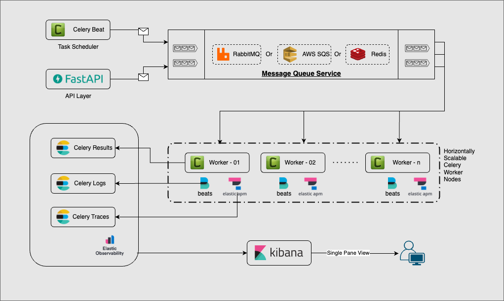

# ElastiFast

ElastiFast is a high-performance, scalable logging and observability framework designed to ingest, process, and analyze data efficiently using Elasticsearch, Celery, and FireLens. This project provides deep integration with various services such as Atlassian, Jira, Postman, and Zendesk, ensuring seamless data collection and analysis.

## Architecture



## Features

- **Native Elasticsearch Backend**: Visualise task results natively in Elasticsearch using Kibana.
- **Configurable Task Queue**: Distributed task execution using AWS SQS, RabbitMQ or Redis as the broker.
- **Native Elastic APM Integration**: Performance monitoring with Elastic APM.

## Configuration

ElastiFast requires several environment variables to be set. These variables can be provided via:

1. **Environment Variables** (Preferred for AWS ECS)
2. **`.env` File** (For local development)
3. **YAML Configuration File** (`settings.yaml`)

### Required Configuration

| Variable Name                      | Description                                      |
|------------------------------------|--------------------------------------------------|
| `elasticsearch_host`               | Elasticsearch host address                       |
| `elasticsearch_port`               | Elasticsearch port (default: `9200`)             |
| `elasticsearch_ssl_enabled`        | Enable SSL for Elasticsearch (`true`/`false`)    |
| `elasticsearch_verify_certs`       | Verify SSL certificates (`true`/`false`)         |
| `elasticsearch_username`           | Elasticsearch username                           |
| `elasticsearch_password`           | Elasticsearch password                           |
| `celery_broker_url`                | Celery broker URL (e.g., SQS, Redis)             |
| `elasticapm_service_name`          | Elastic APM service name                         |
| `elasticapm_server_url`            | Elastic APM server URL                           |
| `elasticapm_es_url`                | Elasticsearch URL for APM                        |
| `elasticapm_secret_token`          | Elastic APM secret token                         |

### Optional Configuration

| Variable Name                      | Description                                      |
|------------------------------------|--------------------------------------------------|
| `celery_broker_transport_options`  | Additional transport options for Celery broker   |
| `celery_beat_schedule`             | Celery beat schedule                             |
| `celery_beat_interval`             | Celery beat interval                             |
| `atlassian_org_id`                 | Atlassian organization ID                        |
| `atlassian_secret_token`           | Atlassian API token                              |
| `jira_url`                         | Jira instance URL                                |
| `jira_username`                    | Jira account userna me                           |
| `jira_api_key`                     | Jira API key                                     |
| `postman_secret_token`             | Postman API token                                |
| `zendesk_username`                 | Zendesk username                                 |
| `zendesk_api_key`                  | Zendesk API key                                  |
| `zendesk_tenant`                   | Zendesk tenant URL                               |

## Running the Application

Install the application dependencies
```bash
poetry install --no-root
```

Activate the poetry environment
```bash
eval $(poetry env activate)
```

Start the FastAPI service

```bash
uvicorn elastifast.app.main:app --reload
```

To run Celery workers:

```bash
celery -A elastifast.tasks worker --loglevel=info -E
```

To schedule periodic tasks with Celery Beat:

```bash
celery -A elastifast.tasks beat --loglevel=info
```

## Deployment

ElastiFast is designed to run on any container native service such as docker-compose, AWS ECS, or K8S. Images for the same are available under `docker pull ghcr.io/nachiket-lab/elastifast:${tag name}`.

Alternatively, you could build the required docker image using the provided Dockerfile.

1. **Build Docker Image**
   ```sh
   docker build -t elastifast .
   ```

2. **Push to a container registry**
   ```sh
   aws ecr get-login-password --region <region> | docker login --username AWS --password-stdin <account_id>.dkr.ecr.<region>.amazonaws.com
   docker tag elastifast:latest <account_id>.dkr.ecr.<region>.amazonaws.com/elastifast:latest
   docker push <account_id>.dkr.ecr.<region>.amazonaws.com/elastifast:latest
   ```

3. **Deploy to ECS, Docker Swarm, Compose or K8S**
   - Set environment variables
   - Define log collectors to ship data to ES
   - Validate tasks are running


# Development

## Prerequisites

Ensure you have the following installed and configured before setting up ElastiFast:

- Python 3.11+
- Docker (for local development)
- Elasticsearch (8.x recommended)
- Redis, RabbitMQ or AWS SQS (for Celery message queue)

## Installation

Clone the repository:

```sh
git clone https://github.com/nachiket-lab/ElastiFast.git
cd ElastiFast
```

Install poetry and use it to install the package

```sh
poetry install --no-root
```

## Contributing

We welcome contributions! Please follow these steps:

1. Fork the repository
2. Create a feature branch (`git checkout -b feature-branch`)
3. Commit changes (`git commit -m "Add new feature"`)
4. Push to GitHub (`git push origin feature-branch`)
5. Create a pull request

## License

ElastiFast is released under the **MIT License**.

## Contact

For any issues, open a GitHub issue or reach out to [Nachiket Vartak](https://github.com/nachiket-lab).

